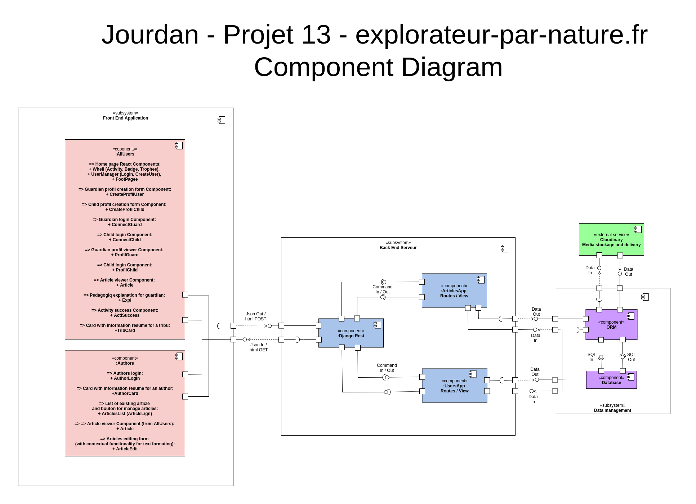
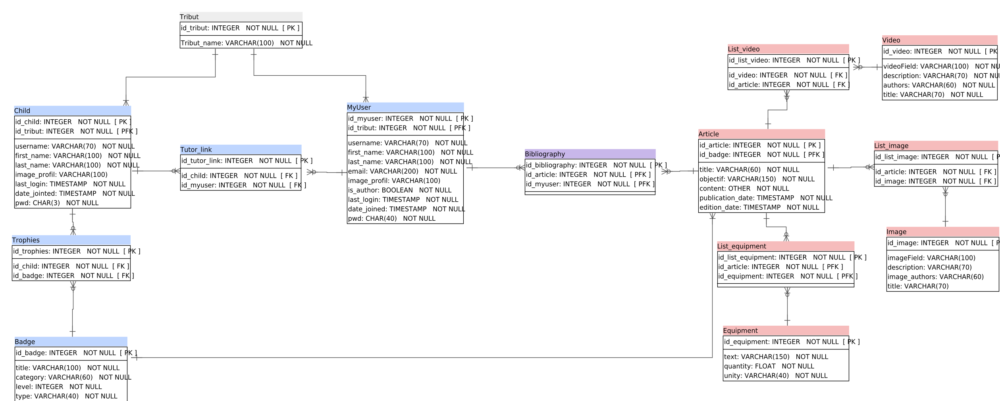

# explorateur-par-nature.fr

## I - Introduction

### I-1 - Aim of the website
This website is conceived for children with the supervision of a adult guardian, for realise manual activity, 
with a pedagogical goal and mainly axes on nature. 
It allows user to create a "tribute" constitute by adult(s) guardian(s) profiles and child(s) profiles. 
After profile creation, child(s) will be able to consult article and realise activities describe in this article 
(with supervision of an adult(s) guardian(s)). 
When the activity is successfully completed, the guardian or the child will valid the activity. 
After completion of activities on the same them, with a progression, the child win a virtual badge. 
After the completion of all badge, the child win a virtual trophy.


### I-2 Licence

See licence file (code is xxx open source, licence, content is xxx licence). 

### I-3 Requirements

See requirements file. 

### I-4 - Get started

1. Clone the project to your machine ```[git clone https://github.com/sebajou/explorateur-par-nature.fr]```
2. Navigate into the diretory ```[cd django-todo-react]```
3. Source the virtual environment ```[pipenv shell]```
4. Install the dependencies ```[pipenv install]```
5. Navigate into the frontend directory ```[cd frontend]```
5. Install the dependencies ```[npm install]```

### I-5 - How to run
You will need two terminals pointed to the frontend and backend directories to start the servers for this application.

1. Run this command to start the backend server in the ```[backend]``` directory: ```[python manage.py runserver]``` (You have to run this command while you are sourced into the virtual environment)
2. Run this command to start the frontend development server in the ```[frontend]``` directory: ```[npm install]``` (This will start the frontend on the adddress [localhost:3000](http://localhost:3000))

### I-6 - Website architecture
Website designs in React - Django Rest - Django - Postgres, with a stockage of media on cloudinary. 


*Website architecture*

Website is designs with React, bootstrap CSS, HTML 5 (stand-alone frontend), 
Django Rest (backend API), Django (backend, ORM) and Postgres (database): 
+ Django allow database consultation and writing, and calculation. 
+ Django Rest consist of an API, Django Rest serialise the data from Django and database to feed the front. 
+ Front is realise with stand-alone React. 

Database is divide in two sets of table: 
+ One about user (guardians and children) and their own badge and trophies, 
+ One about articles and their media. 
This database serve front through Django Rest API.
The front is divide in two part: 
+ One public part for the user (guardians, children and tributes), 
dedicated for the article consultation, for the badge and trophies attribution. 
+ One private, dedicated for authors, for article conception, with online tools for articles editing. 

## II - Database


*Database architecture*

PostgreSQL database is constituted by two group of tables:
+ Tables link with users profiles and badges management. 
+ Tables link with articles and media management. 

## III - Backend

Django backend is constituted by to app: 
+ UsersApp who deal with users profiles and badges managements. 
+ ArticlesApp who deal with articles consultation and editing managements. 

## IV - API

This is a Django Rest API. Serializer allow reading of almost all the database (except password), 
and writing on an important part of the database.  

## V - Front

React front are divide in two page:
+ Users page. 
+ Authors page. 

### V-1 - List of components

